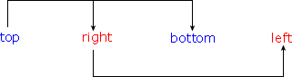
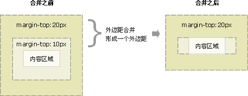

# 2. 样式

|背景| 	描述|
|---|---|
|background| 	简写属性，作用是将背景属性设置在一个声明中。|
|background-attachment| 	背景图像是否固定或者随着页面的其余部分滚动。|
|background-color| 	设置元素的背景颜色。|
|background-image| 	把图像设置为背景。|
|background-position| 	设置背景图像的起始位置。|
|background-repeat| 	设置背景图像是否及如何重复。|

|文字|	描述|
|---|---|
|color| 	设置文本颜色|
|direction| 	设置文本方向。|
|line-height| 	设置行高。|
letter-spacing| 	设置字符间距。|
|text-align| 	对齐元素中的文本。|
|text-decoration| 	向文本添加修饰。|
|text-indent| 	缩进元素中文本的首行。|
|text-transform| 	控制元素中的字母。|
|unicode-bidi| 	设置文本方向。|
|white-space| 	设置元素中空白的处理方式。|
|word-spacing| 	设置字间距。|

|字体| 	描述|
|---|---|
|font| 	简写属性。作用是把所有针对字体的属性设置在一个声明中。|
|font-family| 	设置字体系列。|
|font-size| 	设置字体的尺寸。|
|font-style| 	设置字体风格。|
|font-variant| 	以小型大写字体或者正常字体显示文本。|
|font-weight| 	设置字体的粗细。|

|列表| 	描述|
|---|---|
|list-style| 	简写属性。用于把所有用于列表的属性设置于一个声明中。|
|list-style-image| 	将图象设置为列表项标志。|
|list-style-position| 	设置列表中列表项标志的位置。|
|list-style-type| 	设置列表项标志的类型。|

|表格| 	描述|
|---|---|
|border-collapse| 	设置是否把表格边框合并为单一的边框。|
|border-spacing| 	设置分隔单元格边框的距离。|
|caption-side| 	设置表格标题的位置。|
|empty-cells| 	设置是否显示表格中的空单元格。|
|table-layout| 	设置显示单元、行和列的算法。|

|轮廓| 	描述|
|---|---|
|outline| 	在一个声明中设置所有的轮廓属性。|
|outline-color| 	设置轮廓的颜色。|
|outline-style| 	设置轮廓的样式。|
|outline-width| 	设置轮廓的宽度。|

|内边距| 	描述|
|---|---|
|padding| 	简写属性。作用是在一个声明中设置元素的所内边距属性。|
|padding-bottom| 	设置元素的下内边距。|
|padding-left| 	设置元素的左内边距。|
|padding-right| 	设置元素的右内边距。|
|padding-top| 	设置元素的上内边距。|

|边框| 	描述|
|---|---|
|border| 	简写属性，用于把针对四个边的属性设置在一个声明。|
|border-style| 	用于设置元素所有边框的样式，或者单独地为各边设置边框样式。|
|border-width| 	简写属性，用于为元素的所有边框设置宽度，或者单独地为各边边框设置宽度。|
|border-color| 	简写属性，设置元素的所有边框中可见部分的颜色，或为 4 个边分别设置颜色。|
|border-bottom| 	简写属性，用于把下边框的所有属性设置到一个声明中。|
|border-bottom-color| 	设置元素的下边框的颜色。|
|border-bottom-style| 	设置元素的下边框的样式。|
|border-bottom-width| 	设置元素的下边框的宽度。|
|border-left| 	简写属性，用于把左边框的所有属性设置到一个声明中。|
|border-left-color| 	设置元素的左边框的颜色。|
|border-left-style| 	设置元素的左边框的样式。|
|border-left-width| 	设置元素的左边框的宽度。|
|border-right| 	简写属性，用于把右边框的所有属性设置到一个声明中。|
|border-right-color| 	设置元素的右边框的颜色。|
|border-right-style| 	设置元素的右边框的样式。|
|border-right-width| 	设置元素的右边框的宽度。|
|border-top| 	简写属性，用于把上边框的所有属性设置到一个声明中。|
|border-top-color| 	设置元素的上边框的颜色。|
|border-top-style| 	设置元素的上边框的样式。|
|border-top-width| 	设置元素的上边框的宽度。|

|外边框| 	描述|
|---|---|
|margin| 	简写属性。在一个声明中设置所有外边距属性。|
|margin-bottom| 	设置元素的下外边距。|
|margin-left| 	设置元素的左外边距。|
|margin-right| 	设置元素的右外边距。|
|margin-top| 	设置元素的上外边距。|


# 3. 框模式


例子：


提示：

1. 内边距、边框和外边距可以应用于一个元素的所有边，也可以应用于单独的边。
2. 外边距可以是负值，而且在很多情况下都要使用负值的外边距。

**浏览器兼容性**

根据 W3C 的规范，元素内容占据的空间是由 width 属性设置的，而内容周围的 padding 和 border 值是另外计算的。不幸的是，IE5.X 和 6 在怪异模式中使用自己的非标准模型。这些浏览器的 width 属性不是内容的宽度，而是内容、内边距和边框的宽度的总和。

虽然有方法解决这个问题。但是目前最好的解决方案是回避这个问题。也就是，**不要给元素添加具有指定宽度的内边距，而是尝试将内边距或外边距添加到元素的父元素和子元素。**

## 3.1 值复制

```css
//有时，我们会输入一些重复的值：
p {margin: 0.5em 1em 0.5em 1em;}

//通过值复制，您可以不必重复地键入这对数字。上面的规则与下面的规则是等价的：
p {margin: 0.5em 1em;}
```
CSS 定义了一些规则，允许为外边距指定少于 4 个值。规则如下：

    如果缺少左外边距的值，则使用右外边距的值。
    如果缺少下外边距的值，则使用上外边距的值。
    如果缺少右外边距的值，则使用上外边距的值。

下图提供了更直观的方法来了解这一点：



```css
h1 {margin: 0.25em 1em 0.5em;}	
/* 等价于 0.25em 1em 0.5em 1em */
h2 {margin: 0.5em 1em;}		
/* 等价于 0.5em 1em 0.5em 1em */
p {margin: 1px;}			
/* 等价于 1px 1px 1px 1px */
```

## 3.2 外边距合并

**外边距合并指的是，当两个垂直外边距相遇时，它们将形成一个外边距。**

**合并后的外边距的高度等于两个发生合并的外边距的高度中的较大者。**

1. 当一个元素出现在另一个元素上面时，第一个元素的下外边距与第二个元素的上外边距会发生合并。


2. 当一个元素包含在另一个元素中时（假设没有内边距或边框把外边距分隔开），它们的上和/或下外边距也会发生合并。



3. 外边距甚至可以与自身发生合并（假设有一个空元素，它有外边距，但是没有边框或填充。在这种情况下，上外边距与下外边距就碰到了一起，它们会发生合并）


4. 如果这个外边距遇到另一个元素的外边距，它还会发生合并：


**外边距合并的意义：**

以由几个段落组成的典型文本页面为例。第一个段落上面的空间等于段落的上外边距。如果没有外边距合并，后续所有段落之间的外边距都将是相邻上外边距和下外边距的和。这意味着段落之间的空间是页面顶部的两倍。如果发生外边距合并，段落之间的上外边距和下外边距就合并在一起，这样各处的距离就一致了。


**注意：**

只有普通文档流中块框的垂直外边距才会发生外边距合并。**行内框、浮动框或绝对定位之间的外边距不会合并。**

# 4. 定位

**一切皆为框**

div、h1 或 p 元素常常被称为块级元素。这意味着这些元素显示为一块内容，即**“块框”**。与之相反，span 和 strong 等元素称为“行内元素”，这是因为它们的内容显示在行中，即**“行内框”**。

您可以使用 display 属性改变生成的框的类型。这意味着，通过将 display 属性设置为 block，可以让行内元素（比如 a 元素）表现得像块级元素一样。还可以通过把 display 设置为 none，让生成的元素根本没有框。这样的话，该框及其所有内容就不再显示，不占用文档中的空间。

但是在一种情况下，即使没有进行显式定义，也会创建块级元素。这种情况发生在把一些文本添加到一个块级元素（比如 div）的开头。即使没有把这些文本定义为段落，它也会被当作段落对待：

```css
<div>
some text
<p>Some more text.</p>
</div>
```
块级元素的文本行也会发生类似的情况。假设有一个包含三行文本的段落。每行文本形成一个无名框。无法直接对无名块或行框应用样式，因为没有可以应用样式的地方（注意，行框和行内框是两个概念）。但是，这有助于理解在屏幕上看到的所有东西都形成某种框。

**CSS 定位机制**

CSS 有三种基本的定位机制：普通流、浮动和绝对定位。

除非专门指定，否则所有框都在普通流中定位。

块级框从上到下一个接一个地排列，框之间的垂直距离是由框的垂直外边距计算出来。

行内框在一行中水平布置。可以使用水平内边距、边框和外边距调整它们的间距。但是，垂直内边距、边框和外边距不影响行内框的高度。由一行形成的水平框称为行框（Line Box），行框的高度总是足以容纳它包含的所有行内框。不过，设置行高可以增加这个框的高度。

|定位| 	描述|
|---|---|
|position| 	把元素放置到一个静态的、相对的、绝对的、或固定的位置中。|
|top| 	定义了一个定位元素的上外边距边界与其包含块上边界之间的偏移。|
|right| 	定义了定位元素右外边距边界与其包含块右边界之间的偏移。|
|bottom| 	定义了定位元素下外边距边界与其包含块下边界之间的偏移。|
|left| 	定义了定位元素左外边距边界与其包含块左边界之间的偏移。|
|overflow| 	设置当元素的内容溢出其区域时发生的事情。|
|clip| 	设置元素的形状。元素被剪入这个形状之中，然后显示出来。|
|vertical-align| 	设置元素的垂直对齐方式。|
|z-index| 	设置元素的堆叠顺序。|

|position| 	描述|
|---|---|
|static|    元素框正常生成。块级元素生成一个矩形框，作为文档流的一部分，行内元素则会创建一个或多个行框，置于其父元素中。|
|relative| 	元素框偏移某个距离。元素仍保持其未定位前的形状，它原本所占的空间仍保留。|
|absolute| 	元素框从文档流完全删除，并相对于其包含块定位。包含块可能是文档中的另一个元素或者是初始包含块。元素原先在正常文档流中所占的空间会关闭，就好像元素原来不存在一样。元素定位后生成一个块级框，而不论原来它在正常流中生成何种类型的框。|
|fixed| 	元素框的表现类似于将 position 设置为 absolute，不过其包含块是视窗本身。|

提示：相对定位实际上被看作普通流定位模型的一部分，因为元素的位置相对于它在普通流中的位置。

## 4.1 相对定位

```css
#box_relative {
  position: relative;
  left: 30px;
  top: 20px;
}
```


## 4.2 绝对定位

```css
#box_relative {
  position: absolute;
  left: 30px;
  top: 20px;
}
```


绝对定位的元素的位置相对于最近的已定位祖先元素，如果元素没有已定位的祖先元素，那么它的位置相对于最初的包含块。

对于定位的主要问题是要记住每种定位的意义。所以，现在让我们复习一下学过的知识吧：相对定位是“相对于”元素在文档中的初始位置，而绝对定位是“相对于”最近的已定位祖先元素，如果不存在已定位的祖先元素，那么“相对于”最初的包含块。

## 4.3 浮动


**浮动的框可以向左或向右移动，直到它的外边缘碰到包含框或另一个浮动框的边框为止。**

**由于浮动框不在文档的普通流中，所以文档的普通流中的块框表现得就像浮动框不存在一样。**

1. 当把框 1 向右浮动时，它脱离文档流并且向右移动，直到它的右边缘碰到包含框的右边缘:


2. 当框 1 向左浮动时，它脱离文档流并且向左移动，直到它的左边缘碰到包含框的左边缘。因为它不再处于文档流中，所以它不占据空间，实际上覆盖住了框 2，使框 2 从视图中消失。

3. 如果把所有三个框都向左移动，那么框 1 向左浮动直到碰到包含框，另外两个框向左浮动直到碰到前一个浮动框。


4. 如果包含框太窄，无法容纳水平排列的三个浮动元素，那么其它浮动块向下移动，直到有足够的空间。

5. 如果浮动元素的高度不同，那么当它们向下移动时可能被其它浮动元素“卡住”.


### 4.3.1 行框和清理

浮动框旁边的行框被缩短，从而给浮动框留出空间，行框围绕浮动框。因此，创建浮动框可以使文本围绕图像：


要想阻止行框围绕浮动框，需要对该框应用 clear 属性。clear 属性的值可以是 left、right、both 或 none，它表示框的哪些边不应该挨着浮动框。

为了实现这种效果，在被清理的元素的上外边距上添加足够的空间，使元素的顶边缘垂直下降到浮动框下面：


假设希望让一个图片浮动到文本块的左边，并且希望这幅图片和文本包含在另一个具有背景颜色和边框的元素中。您可能编写下面的代码：

``` css html
.news {
  background-color: gray;
  border: solid 1px black;
  }

.news img {
  float: left;
  }

.news p {
  float: right;
  }

<div class="news">

<p>some text</p>
</div>
```
这种情况下，出现了一个问题。因为浮动元素脱离了文档流，所以包围图片和文本的 div 不占据空间。如何让包围元素在视觉上包围浮动元素呢？需要在这个元素中的某个地方应用 clear.


不幸的是出现了一个新的问题，由于没有现有的元素可以应用清理，所以我们只能添加一个空元素并且清理它。

``` css html
.news {
  background-color: gray;
  border: solid 1px black;
  }

.news img {
  float: left;
  }

.news p {
  float: right;
  }

.clear {
  clear: both;
  }

<div class="news">

<p>some text</p>
<div class="clear"></div>
</div>
```

这样可以实现我们希望的效果，但是需要添加多余的代码。常常有元素可以应用 clear，但是有时候不得不为了进行布局而添加无意义的标记。

不过我们还有另一种办法，那就是对容器 div 进行浮动：

``` css html
.news {
  background-color: gray;
  border: solid 1px black;
  float: left;
  }

.news img {
  float: left;
  }

.news p {
  float: right;
  }

<div class="news">

<p>some text</p>
</div>
```

这样会得到我们希望的效果。不幸的是，下一个元素会受到这个浮动元素的影响。为了解决这个问题，有些人选择对布局中的所有东西进行浮动，然后使用适当的有意义的元素（常常是站点的页脚）对这些浮动进行清理。这有助于减少或消除不必要的标记。

事实上，W3School 站点上的所有页面都采用了这种技术，如果您打开我们使用 CSS 文件，您会看到我们对页脚的 div 进行了清理，而页脚上面的三个 div 都向左浮动。